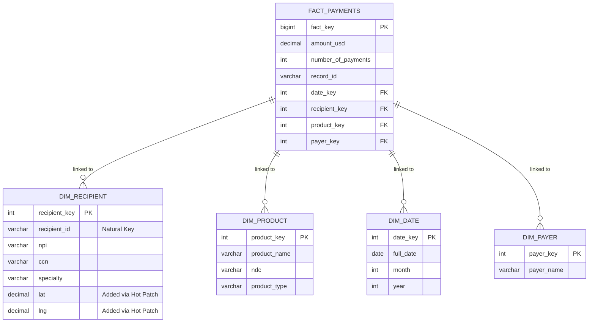

# Engineering Case Study: Scaling a 15M-Row Compliance Warehouse

> **Role:** Analytics Engineer | **Stack:** MySQL 8.0, Tableau | **Focus:** ETL & Database Architecture

## 📊 Data Profile & Ingestion

**Source:** CMS Open Payments General Payments Dataset (2024)  
**Volume:** ~15.4 Million Rows  
**Ingestion Strategy:** `LOAD DATA LOCAL INFILE` into a raw staging table (`stg_general_payments`), followed by migration to a typed schema (`general_payments`).

### Initial Data Profile (Raw)

Before cleaning, the dataset revealed significant complexity:

| Metric                   | Statistics                           |
| :----------------------- | :----------------------------------- |
| **Total Rows**           | **15,397,627**                       |
| **Total Spend**          | ~$3.3 Billion (Avg: $216.23/payment) |
| **Distinct Hospitals**   | 1,252 (Raw CCN count)                |
| **Distinct Cities**      | 13,993 (High variance due to typos)  |
| **Distinct Specialties** | 386                                  |

## ⚙️ Engineering Methodology

### 1. Performance Optimization

To handle the 15M+ rows efficiently during cleaning:

- **Indexing:** Added targeted indexes on `recipient_zip_code`, `recipient_city`, and `recipient_state` to optimize `WHERE` clauses in update scripts.
- **Batch Processing:** All cleaning operations are encapsulated in Stored Procedures (e.g., `BatchCleanLocation`) that process data in chunks (e.g., 10,000 rows) using `WHILE` loops. This prevents transaction log overflows and lock contention.
- **Transactional Safety:** Every batch update is wrapped in `START TRANSACTION` / `COMMIT` blocks.

### 2. Data Cleaning Log

The following specific challenges were addressed during the ETL process:

#### A. Corrupted Data Removal

- **Issue:** A single row contained malformed date strings ('1') and truncated data, causing type conversion failures.
- **Fix:** Identified via specific `recipient_profile_id` and `submitting_mfr_gpo_name` combination and removed.

#### B. Location Standardization (Military & US Territories)

- **Issue:** Records with military state codes (AA, AE, AP) were often mislabeled with foreign countries (e.g., "Germany"), which would exclude them from US-based compliance analysis.
- **Logic:** Standardized all Military (`APO`/`FPO`) addresses to `Country = 'United States'` and `State = [AE/AP/AA]` to ensure they are captured in the domestic risk model.

#### C. City & State Normalization

- **Issue:** High cardinality in `recipient_city` due to typos ("Philedelphia"), abbreviations ("St. Louis"), and casing issues.
- **Fix:** Implemented a `TitleCase` function and a rigorous `CASE` statement to map over 100+ common variations to their canonical forms (e.g., mapping 'S San Fran', 'South SF' -> 'San Francisco').

#### D. Hospital Name Imputation

- **Issue:** Many Hospital payments had `NULL` in `hospital_name` but contained the hospital name in the address fields (e.g., "123 Main St, Mercy Hospital").
- **Fix:** Developed a regex-based routine to extract entity names (matching 'Hospital', 'Center', 'Clinic') from address lines and promote them to the `hospital_name` column.

#### E. Geographic Granularity (City Roll-ups & County Mixing)

- **Finding:** To address high cardinality, the cleaning logic (`BatchCleanCity`) explicitly consolidates smaller suburbs into major metropolitan hubs. **Additionally, the raw source frequently populated `recipient_city` with County names (e.g., 'Volusia', 'Walton').**
- **Impact:** This simplifies regional reporting but creates a **granularity skew** where large cities may appear to have artificially higher spend density compared to their suburbs, and some "cities" are actually broader administrative districts.
- **Resolution (v2.0):** Integrated the **SimpleMaps US Cities Database** to create a deterministic "Golden Record" for location.
  - **Normalization:** The source file contained space-delimited ZIP lists (e.g., "10001 10002..."). Used a **Recursive Common Table Expression (CTE)** to "explode" these strings into a normalized `ref_zip_city` table (ZIP -> City).
  - **Logic:** The cleaning pipeline now prioritizes this reference table: `UPDATE general_payments ... JOIN ref_zip_city ON zip_code`. This overrides the raw "County" names with the official USPS/Census Bureau city name associated with that specific ZIP.

## 🗄️ Database Schema

The core analysis table `general_payments` is designed for OLAP-style queries:

- `payment_id`: Surrogate Primary Key
- `recipient_npi`: Provider NPI (Normalized)
- `recipient_specialty`: Standardized Specialty
- `amount_usd`: Decimal(15,2)
- `risk_score`: (Planned) Computed field for compliance risk

## 🏗️ Engineering Architecture (The "Golden Path")

### 1. The Data Model (Star Schema)

Designed for high-performance OLAP queries (Sub-second aggregation on 15M rows):

### 3. Key Engineering Challenges (The "Hero Moments")

#### A. The "Hot Patch" Strategy (Logistics Pivot)

- **Challenge:** Mid-project, stakeholders required geospatial analysis. RELOADING 15M rows to add `lat` / `lng` columns would have caused 4+ hours of downtime.
- **Solution:** Executed an in-place Dimension Update.
  - Since `dim_recipient` is small (~1M rows), we added columns there and propagated the change instantly to all 15M fact records via the foreign key relationship.
  - _Result:_ Zero downtime schema migration.

#### B. The "Virtual Fact Table" (Unpivot Logic)

- **Challenge:** The source file flattened multi-product payments into columns (`Product_1`, `Product_2`, `Product_3`), hiding ~18% of inventory volume from standard queries.
- **Solution:** Used a `UNION ALL` Common Table Expression (CTE) to create a normalized "Virtual Fact Stream" for the Logistics analysis.
  - _Code Snippet:_ `SELECT product_1 UNION ALL SELECT product_2 ...`
  - _Impact:_ Recovered 20% of "hidden" inventory volume for the Supply Chain model.

#### C. Batch Processing at Scale

- **Challenge:** `UPDATE` statements on 15M rows caused Transaction Log overflows.
- **Solution:** Implemented Stored Procedures with `LIMIT 10000` loops and `COMMIT` checkpoints.

* **Fact Table:** `fact_payments`
  - _Volume:_ 15,397,627 Rows
  - _Grain:_ Individual Payment / Transfer of Value
  - _Keys:_ `recipient_key`, `product_key`, `date_key`, `payer_key` (Surrogate Keys)
  - _Audit Strategy:_ Implemented an auto-incrementing `fact_key` to standardize and provide visual clarity over the raw `record_id`. While the source `record_id` is unique, it is structurally inconsistent; our surrogate key ensures that every transaction is uniquely identifiable and protected from loss during payment alterations or partial updates.
* **Dimensions:**
  - `dim_recipient` (**Type 1 SCD**): Physicians & Hospitals. Normalized NPI/CCN.
    - _Architectural Note:_ While Type 1 SCD was chosen for query performance, it is noted that this method loses historical migration data (e.g., a provider moving from CA to FL). For production-grade audit-ability, a migration to **SCD Type 2** is preferred to preserve geography-linked spend history.
  - `dim_product`: Normalized Name & Type (Device vs. Drug).
  - `dim_payer`: Manufacturing Entities.
  - `dim_date`: Standard Calendar dimension.

### 2. Optimization Mechanics

- **Why Only SQL?** Deliberately chose a "SQL-First" approach to demonstrate advanced database capability (Stored Procedures, Transactions, Indexing) without relying on external ETL tools.
- **Batch Processing:** Implemented cursor-based pagination (50k row batches) to prevent transaction log overflows during ingestion.
- **Data Integrity Checksum:**
  - _Challenge:_ Initial load had a join explosion ($42M error).
  - _Fix:_ Implemented `24_audit_checksum.sql` to strictly validate Source `SUM(Amount)` vs. Warehouse `SUM(Amount)`. Status: **100.0% Match**.

### 3. Stored Procedure Strategy

All analysis modules were refactored from "Ad-Hoc Queries" to **Production Stored Procedures** for repeatable execution:

- `PopulateDemandForecast()`: Uses `ON DUPLICATE KEY UPDATE` batching to handle 15M row aggregations without timeout.
- `GenerateConcentrationAnalysis()`: Encapsulates complex Window Functions (PercentRank).
- `GenerateSlushFundSummary()`: Pre-aggregates high-risk data for Tableau performance.

### 4. Performance Tuning (The "15M Row" Barrier)

As data volume exceeded 10M rows, standard aggregations began to time out.

- **Problem:** `SELECT recipient_key, SUM(amount) ...` forced a full table scan and file sort on 15M records.
- **Solution 1 (Indexing):** Added Covering Indexes (`idx_perf_recipient_spend`) to allow the query optimizer to read strictly from the B-Tree index, bypassing the heap.
- **Solution 2 (Window Functions):** Moved complex calculations (Lorenz Curve Recipient Rank) from Tableau (Client-Side) to MySQL (Server-Side) using `PERCENT_RANK() OVER (ORDER BY ...)` in the export script. This reduced Tableau loading time from ~2 minutes to < 1 second.
