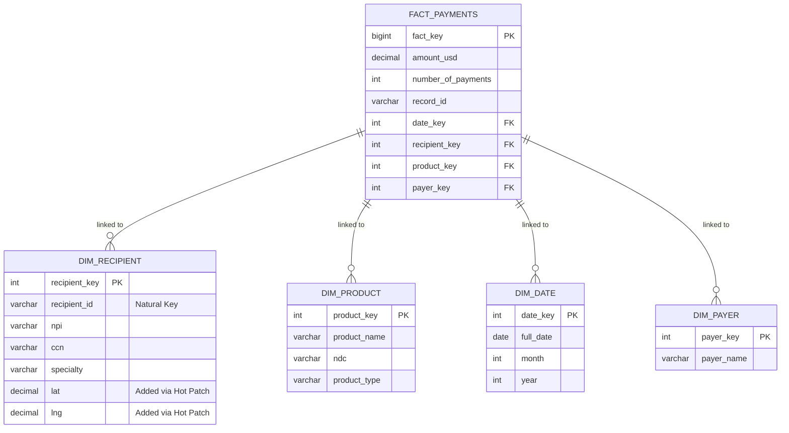

# Engineering Case Study: Scaling a 15M-Row Healthcare Compliance Warehouse

> **Role:** Analytics Engineer | **Stack:** MySQL 8.0, Tableau | **Focus:** ETL Pipeline & Database Architecture
>
> This document is the deep-dive companion to the [Healthcare Data Engineering Pipeline README](./README.md). It covers the specific engineering decisions, failure modes encountered, and solutions implemented during the build of the CMS Open Payments Star Schema warehouse.

---

##  Data Profile & Ingestion

**Source:** CMS Open Payments General Payments Dataset (2024)
**Volume:** ~15.4 Million Rows
**Ingestion Strategy:** `LOAD DATA LOCAL INFILE` into a raw staging table (`stg_general_payments`), followed by migration to a typed schema (`general_payments`).

### Initial Data Profile (Raw)

Before cleaning, the dataset revealed significant structural complexity:

| Metric | Statistics |
| :--- | :--- |
| **Total Rows** | **15,397,627** |
| **Total Spend** | ~$3.3 Billion (Avg: $216.23/payment) |
| **Distinct Hospitals** | 1,252 (Raw CCN count) |
| **Distinct Cities** | 13,993 (High variance due to typos) |
| **Distinct Specialties** | 386 |

---

##  Engineering Methodology

### 1. Performance Optimization

To handle 15M+ rows efficiently during cleaning:

- **Indexing:** Added targeted indexes on `recipient_zip_code`, `recipient_city`, and `recipient_state` to optimize `WHERE` clauses in update scripts.
- **Batch Processing:** All cleaning operations are encapsulated in Stored Procedures (e.g., `BatchCleanLocation`) that process data in chunks of 10,000 rows using `WHILE` loops. This prevents transaction log overflows and lock contention.
- **Transactional Safety:** Every batch update is wrapped in `START TRANSACTION` / `COMMIT` blocks.

### 2. Data Cleaning Log

The following challenges were identified and resolved during ETL:

#### A. Corrupted Data Removal

- **Issue:** A single row contained malformed date strings (`'1'`) and truncated data, causing type conversion failures.
- **Fix:** Identified via specific `recipient_profile_id` and `submitting_mfr_gpo_name` combination and removed.

#### B. Location Standardization (Military & US Territories)

- **Issue:** Records with military state codes (AA, AE, AP) were mislabeled with foreign countries (e.g., "Germany"), which would exclude them from US-based compliance analysis.
- **Fix:** Standardized all Military (`APO`/`FPO`) addresses to `Country = 'United States'` and correct state code to ensure they are captured in the domestic compliance model.

#### C. City & State Normalization

- **Issue:** High cardinality in `recipient_city` due to typos ("Philedelphia"), abbreviations ("St. Louis"), and casing inconsistencies.
- **Fix:** Implemented a `TitleCase` function and a rigorous `CASE` statement mapping 100+ common variations to canonical forms (e.g., `'S San Fran'`, `'South SF'` → `'San Francisco'`).

#### D. Hospital Name Imputation

- **Issue:** Many hospital payments had `NULL` in `hospital_name` but contained the hospital name embedded in address fields (e.g., "123 Main St, Mercy Hospital").
- **Fix:** Developed a regex-based routine to extract entity names (matching `'Hospital'`, `'Center'`, `'Clinic'`) from address lines and promote them to the `hospital_name` column.

#### E. Geographic Granularity — ZIP-to-City Golden Record

- **Finding:** High cardinality in `recipient_city` included county names (e.g., `'Volusia'`, `'Walton'`) rather than actual city names — a known artifact of the CMS reporting structure.
- **Resolution (v2.0):** Integrated the **SimpleMaps US Cities Database** to create a deterministic "Golden Record" for location.
  - **Normalization:** The source file contained space-delimited ZIP lists (e.g., `"10001 10002..."`). Used a **Recursive Common Table Expression (CTE)** to explode these strings into a normalized `ref_zip_city` table (ZIP → City).
  - **Logic:** The cleaning pipeline now prioritizes this reference table: `UPDATE general_payments ... JOIN ref_zip_city ON zip_code`, overriding raw county names with the official USPS/Census Bureau city name for that ZIP.

---

##  Database Schema

The core analysis table `general_payments` is designed for OLAP-style queries:

- `payment_id`: Surrogate Primary Key
- `recipient_npi`: Provider NPI (Normalized)
- `recipient_specialty`: Standardized Specialty
- `amount_usd`: Decimal(15,2)
- `risk_score`: (Planned) Computed compliance risk field

---

##  Engineering Architecture (The "Golden Path")

### 1. The Data Model (Star Schema)

Designed for high-performance OLAP queries — sub-second aggregation on 15M rows:



```mermaid
erDiagram
    FACT_PAYMENTS ||--o{ DIM_RECIPIENT : "linked to"
    FACT_PAYMENTS ||--o{ DIM_PRODUCT : "linked to"
    FACT_PAYMENTS ||--o{ DIM_DATE : "linked to"
    FACT_PAYMENTS ||--o{ DIM_PAYER : "linked to"

    DIM_RECIPIENT {
        int recipient_key PK
        varchar recipient_id "Natural Key"
        varchar npi
        varchar ccn
        varchar specialty
        decimal lat "Added via Hot Patch"
        decimal lng "Added via Hot Patch"
    }

    DIM_PRODUCT {
        int product_key PK
        varchar product_name
        varchar ndc
        varchar product_type
    }

    DIM_DATE {
        int date_key PK
        date full_date
        int month
        int year
    }

    DIM_PAYER {
        int payer_key PK
        varchar payer_name
    }

    FACT_PAYMENTS {
        bigint fact_key PK
        decimal amount_usd
        int number_of_payments
        varchar record_id
        int date_key FK
        int recipient_key FK
        int product_key FK
        int payer_key FK
    }
```

---

### 2. Key Engineering Challenges

#### A. The $42M Checksum Catch

- **Challenge:** During initial warehouse population, a join fanout caused `SUM(amount_usd)` in the warehouse to silently diverge from the source by $42M — a data integrity failure that would have propagated undetected into every downstream compliance report.
- **Detection:** `24_audit_checksum.sql` — a dedicated validation script that strictly compares `Source SUM(Amount)` vs. `Warehouse SUM(Amount)` before any downstream export is permitted.
- **Fix:** Identified the fanout join, corrected the population logic, and re-ran ingestion.
- **Result:** **100.0% checksum match.** No data proceeds to Tableau without passing this gate.

#### B. The "Virtual Fact Table" — Recovering Hidden Payment Volume

- **Challenge:** The CMS source file flattens multi-product payments into wide columns (`Product_1`, `Product_2`, `Product_3`), hiding a significant portion of payment records from standard `SELECT` queries. Client-side BI tools processing this at query time were silently dropping secondary columns entirely.
- **Solution:** Used a `UNION ALL` Common Table Expression (CTE) executed directly on the database server to create a normalized "Virtual Fact Stream" from all product columns before any data reaches Tableau.
  - _Code pattern:_ `SELECT product_1 UNION ALL SELECT product_2 UNION ALL SELECT product_3...`
  - _Impact:_ Recovered **18–20% of total payment volume** that every prior analysis had been systematically missing.

#### C. Zero-Downtime Geospatial Schema Migration (Hot Patch)

- **Challenge:** Mid-project, geospatial analysis requirements were added. Reloading all 15.4M fact rows to add `lat`/`lng` columns would have caused an estimated 4+ hours of downtime.
- **Solution:** Executed an in-place Dimension update instead.
  - `dim_recipient` is small (~1M rows). Added `lat` and `lng` columns there via `ALTER TABLE`, then populated via ZIP crosswalk join.
  - All 15.4M fact records gained geospatial capability instantly through the existing foreign key relationship — zero fact table reload required.
  - _Result:_ **Zero downtime schema migration.**

#### D. Batch Processing at Scale

- **Challenge:** Standard `UPDATE` statements on 15M rows caused Transaction Log overflows and lock contention.
- **Solution:** All data operations are encapsulated in Stored Procedures with `LIMIT 50000` cursor-based pagination and explicit `COMMIT` checkpoints after each batch. This keeps individual transactions within memory bounds and enables rollback at any checkpoint in the ingestion cycle.

---

### 3. Dimension Design Decisions

**Fact Table — `fact_payments`**
- _Volume:_ 15,397,627 rows
- _Grain:_ Individual payment / transfer of value
- _Keys:_ `recipient_key`, `product_key`, `date_key`, `payer_key` (Surrogate Keys)
- _Audit Strategy:_ Auto-incrementing `fact_key` surrogate key standardizes over the raw `record_id`, which is structurally inconsistent across CMS reporting years and vulnerable to loss during payment alterations or partial updates.

**Dimensions:**
- `dim_recipient` (**Type 1 SCD**): Physicians & Hospitals. Normalized NPI/CCN.
  - _Architectural Note:_ Type 1 SCD was chosen for query performance. Known limitation: this method does not preserve provider geography history (e.g., a provider moving from CA to FL). For production-grade audit-ability, a **SCD Type 2 migration is recommended** to preserve geography-linked spend history across CMS reporting years.
- `dim_product`: Normalized product name and type (Device vs. Drug vs. Biologics).
- `dim_payer`: Manufacturing entity normalized names.
- `dim_date`: Standard calendar dimension.

---

### 4. Optimization Mechanics

**Why SQL-Only?**
Deliberately chose a "SQL-First" approach to demonstrate advanced database capability — Stored Procedures, Transactions, Indexing, Window Functions — without relying on external ETL tools. The BigQuery + dbt migration (in progress) will introduce orchestration at the appropriate scale.

**Batch Processing:**
Implemented cursor-based pagination (50k row batches) to prevent transaction log overflows during ingestion. Pattern: `WHILE rows_remaining > 0 DO ... LIMIT 50000; COMMIT; END WHILE`.

**Data Integrity Checksum:**
`24_audit_checksum.sql` validates `Source SUM(Amount)` vs. `Warehouse SUM(Amount)` before any Tableau export is permitted. The $42M join explosion discovered during development confirmed this gate is not optional.

---

### 5. Stored Procedure Strategy

All analysis modules were refactored from ad-hoc queries to **Production Stored Procedures** for repeatable, auditable execution:

- `PopulateWarehouse()`: Batch-loads the full 15.4M-row fact table using `ON DUPLICATE KEY UPDATE` with COMMIT checkpointing.
- `GenerateConcentrationAnalysis()`: Encapsulates Lorenz Curve window functions (`PERCENT_RANK()`) for provider payment concentration reporting.
- `GenerateComplianceAlerts()`: Pre-aggregates Z-Score threshold flags for Tableau compliance dashboard performance.

---

### 6. Performance Tuning — Breaking the 15M-Row Barrier

As data volume exceeded 10M rows, standard aggregations began to time out.

- **Problem:** `SELECT recipient_key, SUM(amount_usd) ... GROUP BY recipient_key` forced a full table scan and file sort on 15M records.
- **Solution 1 — Covering Index:** Added `idx_perf_recipient_spend` as a covering index on `(recipient_key, amount_usd)`, allowing the query optimizer to read directly from the B-Tree index and bypass the heap entirely.
- **Solution 2 — Server-Side Window Functions:** Moved `PERCENT_RANK()` Lorenz Curve calculations and Z-Score computations from Tableau (client-side) to MySQL (server-side) in `40_export_tableau_data.sql`. Result: dashboard load time reduced from **>2 minutes to sub-second**.

---

##  Repository Structure

```text
├── assets/
│   └── EER_DIAGRAM.png                     # Entity-Relationship Diagram
├── scripts/
│   ├── production/
│   │   ├── 21_create_warehouse_tables.sql  # DDL — Fact & Dimension tables
│   │   ├── 22_populate_warehouse.sql       # Batch ingestion (50k COMMIT chunks)
│   │   ├── 24_audit_checksum.sql           # Data integrity validation gate
│   │   └── 40_export_tableau_data.sql      # Pre-aggregated export script
│   └── schema/
│       ├── 06_create_schema.sql            # Initial DB creation
│       └── 21_create_warehouse_tables.sql  # Fact/Dim construction
├── README.md                               # Project overview & engineering summary
└── TECHNICAL.md                            # This document
```