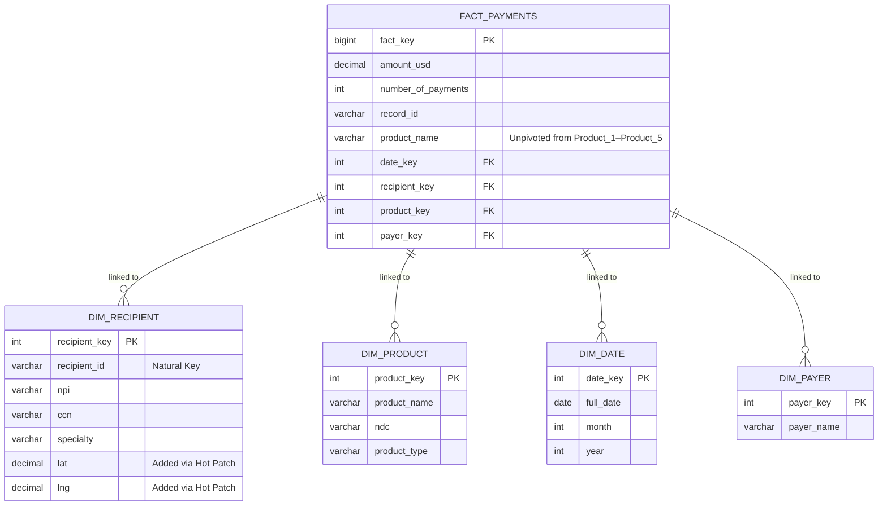

# Engineering Case Study: Scaling a 15M-Row Healthcare Compliance Warehouse

>This document shows the decisions made, the failures encountered, and the reasoning behind every choice.
>
> **Role:** Analytics Engineer | **Stack:** MySQL 8.0 → BigQuery + dbt Fusion, Tableau | **Focus:** ETL/ELT Pipeline & Database Architecture
>
> This document is the deep-dive companion to the [Healthcare Data Engineering Pipeline README](./README.md). It covers the specific engineering decisions, failure modes encountered, and solutions implemented during the build of the CMS Open Payments Star Schema warehouse.

---

## Data Profile & Ingestion

**Source:** CMS Open Payments General Payments Dataset (2024)
**Volume:** 15,385,047 rows (authoritative see Phase 2 note below)
**Ingestion Strategy:** `LOAD DATA LOCAL INFILE` into a raw staging table (`stg_general_payments`), followed by migration to a typed schema (`general_payments`).

> [!NOTE]
> **Row Count Revision (Phase 2 Finding):** The Phase 1 MySQL staging count of 15,397,627 was later found to be inflated. See *Engineering Challenge E* below for the full forensic analysis. The authoritative record count confirmed against the source CSV and validated in BigQuery is **15,385,047**.

### Initial Data Profile (Raw)

Before cleaning, the dataset revealed significant structural complexity:

| Metric | Statistics |
| :--- | :--- |
| **Total Rows (MySQL - Phase 1)** | 15,397,627 *(includes 12,580 phantom rows see Challenge E)* |
| **Total Rows (BigQuery)** | **15,385,047** |
| **Total Spend** | ~$3.3 Billion (Avg: $216.23/payment) |
| **Distinct Hospitals** | 1,252 (Raw CCN count) |
| **Distinct Cities** | 13,993 (High variance due to typos) |
| **Distinct Specialties** | 386 |

---

## Engineering Methodology

### 1. Performance Optimization

To handle 15M+ rows efficiently during cleaning:

- **Indexing:** Added targeted indexes on `recipient_zip_code`, `recipient_city`, and `recipient_state` to optimize `WHERE` clauses in update scripts.
- **Batch Processing:** All cleaning operations are encapsulated in Stored Procedures (e.g., `BatchCleanLocation`) that process data in chunks of 10,000 rows using `WHILE` loops. This prevents transaction log overflows and lock contention.
- **Transactional Safety:** Every batch update is wrapped in `START TRANSACTION` / `COMMIT` blocks.

### 2. Data Cleaning Log

The following challenges were identified and resolved during ETL:

#### Issue 1. Corrupted Data Removal

- **Issue:** A single row contained malformed date strings (`'1'`) and truncated data, causing type conversion failures.
- **Fix:** Identified via specific `recipient_profile_id` and `submitting_mfr_gpo_name` combination and removed.

#### Issue 2. Location Standardization (Military & US Territories)

- **Issue:** Records with military state codes (AA, AE, AP) were mislabeled with foreign countries (e.g., "Germany"), which would exclude them from US-based compliance analysis.
- **Fix:** Standardized all Military (`APO`/`FPO`) addresses to `Country = 'United States'` and correct state code to ensure they are captured in the domestic compliance model.

#### Issue 3. City & State Normalization

- **Issue:** High cardinality in `recipient_city` due to typos ("Philedelphia"), abbreviations ("St. Louis"), and casing inconsistencies.
- **Fix:** Implemented a `TitleCase` function and a rigorous `CASE` statement mapping 100+ common variations to canonical forms (e.g., `'S San Fran'`, `'South SF'` → `'San Francisco'`).

#### Issue 4. Hospital Name Imputation

- **Issue:** Many hospital payments had `NULL` in `hospital_name` but contained the hospital name embedded in address fields (e.g., "123 Main St, Mercy Hospital").
- **Fix:** Developed a regex-based routine to extract entity names (matching `'Hospital'`, `'Center'`, `'Clinic'`) from address lines and promote them to the `hospital_name` column.

#### Issue 5. Geographic Granularity ZIP-to-City Golden Record

- **Finding:** High cardinality in `recipient_city` included county names (e.g., `'Volusia'`, `'Walton'`) rather than actual city names, a known artifact of the CMS reporting structure.
- **Resolution (v2.0):** Integrated the **SimpleMaps US Cities Database** to create a deterministic "Golden Record" for location.
  - **Normalization:** The source file contained space-delimited ZIP lists (e.g., `"10001 10002..."`). Used a **Recursive Common Table Expression (CTE)** to explode these strings into a normalized `ref_zip_city` table (ZIP → City).
  - **Logic:** The cleaning pipeline now prioritizes this reference table: `UPDATE general_payments ... JOIN ref_zip_city ON zip_code`, overriding raw county names with the official USPS/Census Bureau city name for that ZIP.

---

## Database Schema

The core analysis table `general_payments` is designed for OLAP-style queries:

- `payment_id`: Surrogate Primary Key
- `recipient_npi`: Provider NPI (Normalized)
- `recipient_specialty`: Standardized Specialty
- `amount_usd`: Decimal(15,2)
- `risk_score`: (Planned) Computed compliance risk field

---

## Engineering Architecture

### 1. The Data Model (Star Schema)

Designed for high-performance OLAP queries on 21.9M product-level rows:

```mermaid
erDiagram
    FACT_PAYMENTS ||--o{ DIM_RECIPIENT : "linked to"
    FACT_PAYMENTS ||--o{ DIM_PRODUCT : "linked to"
    FACT_PAYMENTS ||--o{ DIM_DATE : "linked to"
    FACT_PAYMENTS ||--o{ DIM_PAYER : "linked to"

    DIM_RECIPIENT {
        int recipient_key PK
        varchar recipient_id "Natural Key"
        varchar npi
        varchar ccn
        varchar specialty
        decimal lat "Added via Hot Patch"
        decimal lng "Added via Hot Patch"
    }

    DIM_PRODUCT {
        int product_key PK
        varchar product_name
        varchar ndc
        varchar product_type
    }

    DIM_DATE {
        int date_key PK
        date full_date
        int month
        int year
    }

    DIM_PAYER {
        int payer_key PK
        varchar payer_name
    }

    FACT_PAYMENTS {
        bigint fact_key PK
        decimal amount_usd
        int number_of_payments
        varchar record_id
        varchar product_name "Unpivoted from Product_1–Product_5"
        int date_key FK
        int recipient_key FK
        int product_key FK
        int payer_key FK
    }
```

---

### 2. Key Engineering Challenges

#### Challenge 1. The $42M Checksum Catch

- **Challenge:** During initial warehouse population, a join fanout caused `SUM(amount_usd)` in the warehouse to silently diverge from the source by $42M a data integrity failure that would have propagated undetected into every downstream compliance report.
- **Detection:** `24_audit_checksum.sql` a dedicated validation script that strictly compares `Source SUM(Amount)` vs. `Warehouse SUM(Amount)` before any downstream export is permitted.
- **Fix:** Identified the fanout join, corrected the population logic, and re-ran ingestion.
- **Result:** **100.0% checksum match.** No data proceeds to Tableau without passing this gate.

#### Challenge 2. The "Virtual Fact Table" Recovering Hidden Payment Volume

- **Challenge:** The CMS source file flattens multi-product payments into wide columns (`Product_1`, `Product_2`, `Product_3`), hiding a significant portion of payment records from standard `SELECT` queries. Client-side BI tools processing this at query time were silently dropping secondary columns entirely.
- **Solution:** Used a `UNION ALL` Common Table Expression (CTE) executed directly on the database server to create a normalized "Virtual Fact Stream" from all product columns before any data reaches Tableau.
  - _Code pattern:_ `SELECT product_1 UNION ALL SELECT product_2 UNION ALL SELECT product_3...`
  - _Impact:_ Recovered **18–20% of total payment volume** that every prior analysis had been systematically missing.

#### Challenge 3. Zero-Downtime Geospatial Schema Migration (Hot Patch)

- **Challenge:** Mid-project, geospatial analysis requirements were added. Reloading all 15.4M fact rows to add `lat`/`lng` columns would have caused an estimated 4+ hours of downtime.
- **Solution:** Executed an in-place Dimension update instead.
  - `dim_recipient` is small (~1M rows). Added `lat` and `lng` columns there via `ALTER TABLE`, then populated via ZIP crosswalk join.
  - All 15.4M fact records gained geospatial capability instantly through the existing foreign key relationship zero fact table reload required.
  - _Result:_ **Zero downtime schema migration.**

#### Challenge 4. Batch Processing at Scale

- **Challenge:** Standard `UPDATE` statements on 15M rows caused Transaction Log overflows and lock contention.
- **Solution:** All data operations are encapsulated in Stored Procedures with `LIMIT 50000` cursor-based pagination and explicit `COMMIT` checkpoints after each batch. This keeps individual transactions within memory bounds and enables rollback at any checkpoint in the ingestion cycle.

#### Challenge 5. Cross-System Row Count Validation A Migration-Discovered Data Quality Finding

- **Discovery:** During Phase 2 BigQuery migration, a checksum comparison revealed a 12,580-row discrepancy: MySQL reported 15,397,627 rows while BigQuery loaded 15,385,047 from the same source CSV.
- **Investigation:** A raw Python line count of the source CSV confirmed **15,385,047 data rows** (15,385,048 total lines including header). BigQuery matched the source exactly. MySQL was over-counting.
- **Root Cause:** MySQL's `LOAD DATA LOCAL INFILE` without explicit quoted newline handling split 12,580 records containing embedded newlines into two rows each a "phantom row" inflation of 0.08%. The split was visible during Phase 1 as a single "shifted row" observed in Workbench but not investigated at the time.
- **Impact on Phase 1 Analysis:** Dollar totals were **unaffected** phantom continuation rows had null payment amounts and did not contribute to `SUM(amount_usd)`. Vendor concentration rankings, Z-score flags, and compliance outputs remained accurate. Row count metrics were over-stated by 0.08%.
- **Resolution:** BigQuery ingestion with `allow_quoted_newlines=True` correctly parses quoted multi-line fields as single records. **BigQuery is the authoritative row count source at 15,385,047 a 100% match against the source CSV.** Phase 1 MySQL is left as documented with this known limitation.
- **Engineering Takeaway:** Cross-system checksum validation during migration is not optional it surfaces data quality assumptions that single-system validation cannot detect.

---

### 3. Dimension Design Decisions

**Fact Table `fact_payments`**
- _Volume:_ 21,934,863 rows *(product-level grain expanded from 15,397,626 source payments via UNION ALL unpivot)*
- _Grain:_ One row per payment × product combination. The CMS source stores up to 5 product columns (`Product_1` through `Product_5`) per payment record. The `UNION ALL` normalization in `23_populate_fact_payments.sql` expands these into individual rows, recovering 6,537,237 product associations that would otherwise be invisible to standard aggregation queries.
- _Keys:_ `recipient_key`, `product_key`, `date_key`, `payer_key` (Surrogate Keys)
- _Audit Strategy:_ Auto-incrementing `fact_key` surrogate key standardizes over the raw `record_id`, which is structurally inconsistent across CMS reporting years and vulnerable to loss during payment alterations or partial updates.

**Dimensions:**
- `dim_recipient` (**Type 1 SCD**): Physicians & Hospitals. Normalized NPI/CCN.
  - _Architectural Note:_ Type 1 SCD was chosen for query performance. Known limitation: this method does not preserve provider geography history (e.g., a provider moving from CA to FL). For production-grade audit-ability, a **SCD Type 2 migration is recommended** to preserve geography-linked spend history across CMS reporting years.
- `dim_product`: Normalized product name and type (Device vs. Drug vs. Biologics).
- `dim_payer`: Manufacturing entity normalized names.
- `dim_date`: Standard calendar dimension.

---

### 4. Optimization Mechanics

**Why SQL-Only?**
Deliberately chose a "SQL-First" approach to demonstrate advanced database capability Stored Procedures, Transactions, Indexing, Window Functions without relying on external ETL tools. The BigQuery + dbt migration (in progress) will introduce orchestration at the appropriate scale.

**Batch Processing:**
Implemented cursor-based pagination (50k row batches) to prevent transaction log overflows during ingestion. Pattern: `WHILE rows_remaining > 0 DO ... LIMIT 50000; COMMIT; END WHILE`.

**Data Integrity Checksum:**
`24_audit_checksum.sql` validates `Source SUM(Amount)` vs. `Warehouse SUM(Amount)` before any Tableau export is permitted. The $42M join explosion discovered during development confirmed this gate is not optional.

---

### 5. Stored Procedure Strategy

All analysis modules were refactored from ad-hoc queries to **Production Stored Procedures** for repeatable, auditable execution:

- `PopulateWarehouse()`: Batch-loads the full 15.4M-row fact table using `ON DUPLICATE KEY UPDATE` with COMMIT checkpointing.
- `GenerateConcentrationAnalysis()`: Encapsulates Lorenz Curve window functions (`PERCENT_RANK()`) for provider payment concentration reporting.
- `GenerateComplianceAlerts()`: Pre-aggregates Z-Score threshold flags for Tableau compliance dashboard performance.

---

### 6. Performance Tuning Breaking the 15M-Row Barrier

As data volume exceeded 10M rows, standard aggregations began to time out.

- **Problem:** `SELECT recipient_key, SUM(amount_usd) ... GROUP BY recipient_key` forced a full table scan and file sort on 15M records.
- **Solution 1 Covering Index:** Added `idx_perf_recipient_spend` as a covering index on `(recipient_key, amount_usd)`, allowing the query optimizer to read directly from the B-Tree index and bypass the heap entirely.
- **Solution 2 Server-Side Window Functions:** Moved `PERCENT_RANK()` Lorenz Curve calculations and Z-Score computations from Tableau (client-side) to MySQL (server-side) in `40_export_tableau_data.sql`. Result: dashboard load time reduced from **>2 minutes to sub-second**.

---

---

## Phase 2 BigQuery + dbt Engineering Notes

### ELT vs ETL Shift

Phase 1 was ETL: data was mutated in-place by stored procedures (`UPDATE general_payments SET ... WHERE ...`). Raw data was destroyed at each step. Re-running required restoring from backup.

Phase 2 is ELT: the raw BigQuery table (`raw_general_payments`) is never touched after load. All cleaning is expressed as SQL `SELECT` expressions in dbt views and materialized tables. Re-running `dbt run` rebuilds the entire pipeline from scratch in ~20 seconds. The raw source is always available for inspection.

### BigQuery SQL Differences Encountered

Porting Phase 1 MySQL logic to BigQuery required several syntax substitutions that are not obvious from documentation alone:

| Phase 1 MySQL | Phase 2 BigQuery | Reason |
|---|---|---|
| `SUBSTRING_INDEX(col, '\|', -1)` | `REGEXP_EXTRACT(col, r'[^|]+$')` | BigQuery has no `SUBSTRING_INDEX` |
| `col REGEXP '^[0-9]+'` | `REGEXP_CONTAINS(col, r'^\d+')` | BigQuery uses `REGEXP_CONTAINS`, RE2 syntax |
| `TitleCase(str)` (custom UDF) | `INITCAP(str)` | BigQuery built-in; handles Unicode correctly |
| `ANY_VALUE(col ORDER BY ...)` | `ARRAY_AGG(col ORDER BY ... LIMIT 1)[OFFSET(0)]` | `ANY_VALUE` in BigQuery does not support `ORDER BY` PostgreSQL-only extension |
| `'Children''s'` (double-quote escape) | `'Children\'s'` (backslash escape) | BigQuery treats `''` as two adjacent string literals, not an escape sequence |
| `UNNEST(SPLIT())` recursive CTE | Native `UNNEST(SPLIT())` | BigQuery supports this natively; MySQL required a 40-line recursive CTE |

### Phase 1 Cleaning Gap Analysis

Before declaring Phase 2 complete, all Phase 1 stored procedures (scripts 7–20) were audited against the dbt staging model to identify gaps. Outcome:

**Ported (High/Medium priority):**
- `07_data_quality_purge` corrupted row filter (`record_id='No'`, `program_year<2000`, numeric `payer_name`) added as staging `WHERE` clause
- `19_clean_recipient_specialty` `REGEXP_EXTRACT(col, r'[^|]+$')` extracts the most-specific segment from CMS pipe-delimited specialty strings; `recipient_primary_specialty` added as a dedicated column
- `16_clean_products` `INITCAP` + trademark strip (`\(R\)|\(TM\)`) applied to all 5 product name slots
- `08_clean_recipient_names` `INITCAP(TRIM(...))` applied to first/middle/last/suffix columns
- `12_clean_city` (partial) `NULLIF(INITCAP(TRIM(recipient_city)), '')` applied in staging so the SimpleMaps fallback city is title-cased rather than raw CMS ALL CAPS; `REGEXP_EXTRACT(zip, r'^\d{5}')` normalizes ZIP+4 codes (e.g. `03811-2131`) to 5 digits, tightening the SimpleMaps ZIP join and fixing display
- `uscities` seed augmentation SimpleMaps does not include PO Box ZIPs or every small municipality; added Burlington CT (06013), West Hartford CT (06107/06110/06117/06119), and Atlanta PO Box ZIP (30384) to cover gaps identified via post-build validation queries

**Deferred (Low priority):**
- `10_clean_military` APO/FPO address fixes for ~100 military base records
- `11_clean_locations` (CleanCity) abbreviation expansion (Ft→Fort, Mt→Mount); superseded by SimpleMaps zip join which provides clean city names for the vast majority of records
- `13_clean_addresses` (CleanAddress) street suffix expansion (AVE→AVENUE); address lines are display-only fields not used in analysis
- `20_apply_specialty_mappings` synonym normalization requires `ref_specialties` seed table; deferred to Phase 3

### dbt Test Engineering

Running `dbt test` for the first time against the live BigQuery tables surfaced four real data issues that the model code had not accounted for:

**1. Dimension uniqueness via `SELECT DISTINCT`**
`dim_physician`, `dim_hospital`, and `dim_company` all used `SELECT DISTINCT` across all columns to deduplicate. The same physician appearing in 10 different payment records with slightly different address data across program years produces 10 rows `SELECT DISTINCT` cannot deduplicate on a single natural key.

Fix: `QUALIFY ROW_NUMBER() OVER (PARTITION BY natural_key ORDER BY program_year DESC) = 1` keeps the most recent year's record per entity, replacing all occurrences of `SELECT DISTINCT` in dimension models.

**2. FK scope on `fct_payments → dim_physician`**
CMS assigns `covered_recipient_profile_id` to ALL recipient types physicians AND hospitals. Hospital profile IDs are not in `dim_physician` (which filters on `recipient_type = 'Covered Recipient Physician'`), so the unscoped relationships test produced 6.3M false failures.

Fix: added `config: where: "recipient_type = 'Covered Recipient Physician'"` to the relationships test in `schema.yml`, scoping the FK check to physician payments only.

**3. `ANY_VALUE(col ORDER BY ...)` not supported**
The `city_lookup` CTE in `dim_physician` and `dim_hospital` used `ANY_VALUE(city ORDER BY population DESC)` to pick the most-populated version of a city name for the fallback geo join. BigQuery silently rejects this with a runtime error.

Fix: `ARRAY_AGG(city ORDER BY population DESC LIMIT 1)[OFFSET(0)]` BigQuery's equivalent pattern for "pick the value from the highest-population row."

**4. Apostrophe escaping in CASE strings**
The `clean_hospital_name` macro and `dim_company` CASE block used `''` (double single-quote) to escape apostrophes inside string literals (`'Children''s Hospital'`). BigQuery parses this as two adjacent string literals and throws a syntax error.

Fix: replaced all `''s` with `\'s` throughout both files.

**5. Corrupted payment dates from CMS upstream (`date_of_payment = '11/30/0002'`)**

After building `dim_date` (a `dbt_utils.date_spine` table covering 2013–2026), the relationships test `fct_payments.payment_date → dim_date.full_date` failed with 64 results 64 payment records whose parsed `payment_date` fell outside the dim_date range.

Investigation: the raw `date_of_payment` field for all 64 records contained the literal string `'11/30/0002'` year 0002 instead of 2024. These are real payments with valid physicians, companies, and dollar amounts. `program_year = 2024` and `payment_publication_date = 01/23/2026` on every affected record confirm the payments are genuine; only the year was corrupted at the CMS source.

> [!NOTE]
> **Engineering Decision: Generic Date Corruption Sentinel**
> Rather than hardcoding the 64 known corrupted `record_id` values —
> brittle against future CMS reprocessing a domain-knowledge
> sentinel was applied: any `payment_date < '2013-01-01'`
> (before the Open Payments program launched) is definitionally
> an upstream error. The year is rebuilt from `program_year`
> while preserving the original month and day components.
> Self-healing for future loads with the same corruption pattern.

Fix: a `cleaned` CTE in `stg_general_payments` sits between `staged` and the final `SELECT`. For any record where `payment_date < '2013-01-01'`, the date is rebuilt as `DATE(program_year, EXTRACT(MONTH FROM payment_date), EXTRACT(DAY FROM payment_date))`. For the 64 current records this produces `2024-11-30`. A future load year with the same corruption produces the correct year automatically no code change required.

Final test result: **29/29 tests passing.**

---

## Repository Structure
See [README.md](./README.md) for the full repository structure.